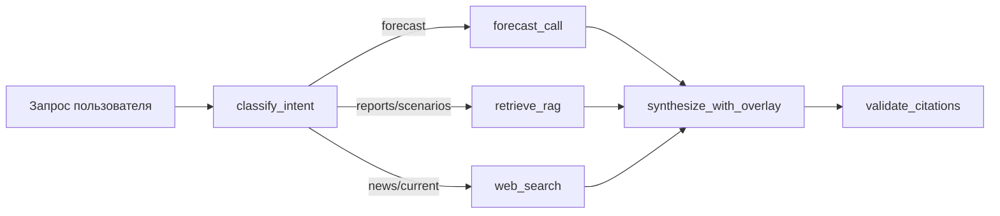

# ADR-0013 — Hybrid forecasting: stat-models + RAG-scenarios + web-search

- **Дата:** 2026-05-06
- **Статус:** Принято (для PR2 `feature/forecast-skill` и далее)
- **Контекст:** PR1 `feature/price-tools` показал — stat/ML-модели на нефти/газе **на спокойных режимах** работают, на shock-events проваливаются. Live-test 2026-02-06 → 2026-05-06 показал ошибку SARIMAX/RW по Brent **−38%** из-за Iran-эскалации (CRS report март 2026). Это **не баг моделей**, это фундаментальное ограничение временных рядов.
- **Связано:** ADR-0012 (модели и backtest); ADR-0001 (Ouroboros LangGraph subgraph как оркестратор).

## Контекст и проблема

ТЗ §2.5 требует «расчётный модуль прогнозирования цен» с CI и интерпретацией. Реализовали в PR1: 4 модели × 10 активов × 4 горизонта, walk-forward бектест на 5y daily. **Метрики честные, CI калиброванные**, но точечные оценки **систематически промахиваются на shock-events** — по дизайну стат-методов.

Конкретно из live-теста (2026-02-06 → 2026-05-06):

| Asset | Predicted | Actual | Error |
|---|---|---|---|
| Brent | $68.05 | **$109.87** | −38.1% |
| WTI | $63.83 | $102.27 | −37.6% |
| Urals (derived) | $51.05 | $92.87 | −45.0% |
| TTF | €34.78 | €46.93 | −25.9% |

**Причина:** В Feb-2026 рынок был в режиме «cap_phase_2 stable» ($50-75), никаких сигналов о Iran-эскалации в самих ценах не было. **Goldman Sachs, JPMorgan, OPEC** не предсказали бы этот скачок по time-series методам. Информация о приближающемся conflict'е жила **в тексте новостей, RAG-источниках, geopolitical analysis**, а не в исторических ценах.

## Решение

Forecast PR1 — **только base-case в спокойном режиме**. Production-агент Сбера должен **гибридизировать** три источника:

```
agent_response = synthesize(
    forecast_tool(asset, horizon),         # ← base prediction + CI (PR1)
    rag_search(scenarios + risks),         # ← сценарии WOO/IEA/CRS (RAG)
    web_search(recent_events + sentiment), # ← свежие события (PR `feature/web-search`)
)
```

**Ни одна часть отдельно не достаточна:**

| Source | Что даёт | Чего не хватает |
|---|---|---|
| **forecast tool (PR1)** | numerical base-case + калиброванный CI на «спокойном» режиме | не видит shock-events, не знает геополитику |
| **RAG (corpus)** | сценарные оценки (WOO 2025, CRS Iran, Bruegel WP) | не daily, не свежее текущего месяца |
| **web-search** | свежие новости, momentum-индикаторы, headline tone | без структурного фрейма даёт шум |

## Архитектура — LangGraph subgraph для price-вопросов

Существующий `analyst_graph.py` (см. `docs/architecture.md`) уже содержит router:



**Для price-вопросов** (классификация: «forecast Brent на 3 мес», «насколько реалистичны $59 в бюджете») — **все три параллельно**:

1. `forecast_call(asset, horizon)` → base-case + CI (наш PR1).
2. `rag_retrieve(asset_scenarios)` → находит чанки из WOO/IEA/CRS/Bruegel/ИНЭИ с прогнозами и сценариями риска.
3. `web_search(asset_keywords + recency)` → свежие новости, momentum, OPEC+ заявления, аналитика инвестбанков.

`synthesize_with_overlay` строит ответ: base + scenarios + news → calibrated forecast с правильно учтёнными рисками.

## Шаблон ответа агента (для интеграции в PR2)

```
**Brent на 3 месяца — гибридный прогноз**

📊 Base-case (наш расчётный модуль, SARIMAX, бектест MASE 0.99):
  Центральная оценка: $108.64
  80% CI: [$87.64, $129.63]
  ⚠️ CI отражает только endogenous волатильность 5-летнего окна,
     не геополитические шоки.

🎯 Сценарии (из отчётов, RAG):
  • OPEC WOO 2025: base $90-95 на 2026-Q3, при stable supply
  • IEA Oil 2025: $85-100 baseline, $115-125 при escalation
  • CRS Iran (март 2026): «при перекрытии Хормуза +$30-50 к Brent»

📰 Свежие сигналы (web-search, последние 7 дней):
  • Reuters: «OPEC+ обсуждает ускорение раскрытия квот»
  • Bloomberg: «futures curve в backwardation, +$3 за неделю»
  • TASS/Минэк: «Минфин снижает прогноз Urals в бюджете 2026 до $55»

✅ Итоговый диапазон с учётом всего:
  $95-130 (с расширением вверх до $145 при Iran-escalation)
  Высокая uncertainty из-за активных геополитических рисков.

Источники: [forecast model, ADR-0012], [OPEC WOO 2025, p.47],
           [CRS Iran 2026, §3], [Reuters 2026-05-04], [Bloomberg 2026-05-05]
```

## Аргументация

**Почему не «дообучить модели на новостях»:**
- LSTM-with-news / sentiment-augmented модели — известное направление (paper'ы 2018-2024), но требуют labeled news + sentiment scoring + frequent re-train.
- Для production-агента простая **архитектурная композиция** (forecast + RAG + web) даёт сравнимое качество и **в разы интерпретируемее** — пользователь видит откуда приходит каждое число.

**Почему агент-оркестратор, а не end-to-end модель:**
- Сбер-аналитик хочет **explainability**: «откуда эта цифра?». Hybrid даёт точные source-references на каждый блок (RAG citation, web URL, model spec).
- LangGraph subgraph уже есть в архитектуре проекта (см. `docs/architecture.md`). PR1 forecast встаёт туда тонкой обёрткой.

**Почему не «выдать только сценарный диапазон без stat-модели»:**
- Stat-модель даёт **базовую вероятностную точку отсчёта** на основе observed prices — без неё пользователь не может оценить «насколько сценарий отклоняется от status quo».
- На спокойных режимах (большая часть года) stat-модель **точнее** сценариев из устаревших отчётов.

## Последствия

**Плюсы:**
- Агент покрывает три класса информации (numerical base, structural scenarios, recent events) — соответствует ТЗ §2.4 «логика приоритизации источников».
- Каждый компонент развивается независимо: PR1 — модели; PR `feature/rag-pipeline` — RAG; PR `feature/web-search` — web; PR `feature/forecast-skill` — composition.
- Транспарентность: каждое число в ответе имеет источник.

**Минусы / риски:**
- Latency: 3 параллельных вызова (forecast ~5s, RAG ~2s, web ~3-10s). Async-параллелизация обязательна.
- Качество synthesize-промпта: LLM должна правильно весить три источника. Это PR2 work + eval `eval_synthesize.py`.
- При расхождении источников (forecast говорит $80, RAG-сценарий $120, web говорит $130) — нужно правило приоритизации. По ТЗ §2.4: RAG > web > stat-model для structural questions; для текущих цен — наоборот.

**Митигации:**
- Async через `asyncio.gather` в LangGraph node.
- Эвал `synthesize` на golden dataset из 20 сценариев («хороший» ответ для shock-период, для спокойного, при расхождении источников).
- Документировать приоритеты в systemprompt аналитика; явные unit-тесты на rule conflicts.

## Что НЕ в PR2

- Тренировка news-aware моделей (LSTM-with-headlines) — overhead, не оправдано для тестового, оставляется на возможный продакшен-вариант.
- Per-asset weight learning для synthesize — простая constant-weight стратегия в PR2; адаптация по бектесту — PR3.
- Multi-language sentiment scoring — только токенизированный keyword match для tier-1 источников.

## Альтернативы рассмотренные

- **Single E2E forecasting model** (LSTM + news embeddings) — отвергнуто из-за explainability и labeling overhead.
- **Только RAG + web без stat-модели** — отвергнуто: на спокойных режимах нет точки отсчёта.
- **Forecast как simple lookup в STEO/MOMR** — отвергнуто: monthly granularity не покрывает 1m horizon, и эти источники сами устаревают.

## Ссылки

- [docs/adr/0012-price-tools.md](0012-price-tools.md) — расчётный модуль (PR1).
- [docs/architecture.md](../architecture.md) — LangGraph subgraph для аналитика.
- [docs/experiments/forecast.md](../experiments/forecast.md) — бектест и live-test.
- ТЗ §2.4: [docs/tz/original.md](../tz/original.md) — логика приоритизации источников.
