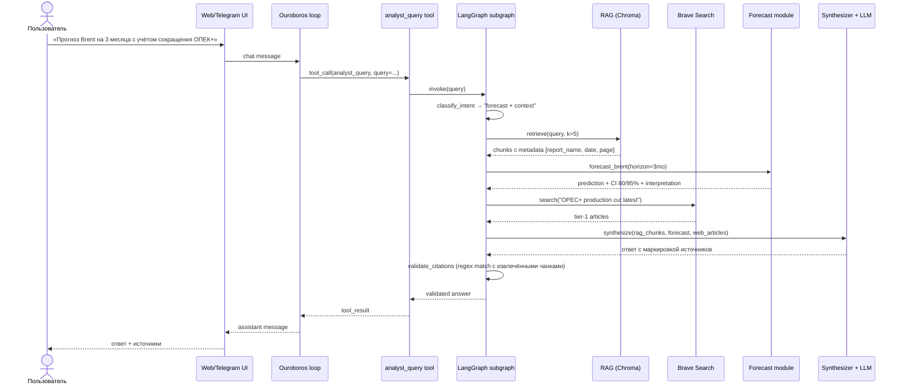

# Архитектура nefteboros

> Документ описывает целевую архитектуру системы. По мере реализации актуализируется.
>
> Оригинальные документы Ouroboros (upstream) — в [docs/upstream/](upstream/).

## High-level

```mermaid
flowchart TB
    User([Пользователь])
    User -->|Web UI| Web[Streamlit / Ouroboros web]
    User -->|Telegram| Bot[Telegram bot<br/>aiogram]

    Web --> Core
    Bot --> Core

    subgraph Core["nefteboros core (форк Ouroboros)"]
        OurLoop[Ouroboros loop<br/>tool dispatcher]
        AnalystTool[Tool: analyst_query]
        ForecastTool[Tool: brent_forecast]
        OurLoop --> AnalystTool
        OurLoop --> ForecastTool
    end

    subgraph LangGraph["LangGraph subgraph (внутри analyst_query)"]
        Classify[classify_intent]
        Router{route}
        RAG[retrieve_rag]
        Web2[web_search]
        Forecast[forecast_call]
        Synth[synthesize_with_citations]
        Validate[validate_citations]

        Classify --> Router
        Router -->|reports| RAG
        Router -->|news/current| Web2
        Router -->|prediction| Forecast
        RAG --> Synth
        Web2 --> Synth
        Forecast --> Synth
        Synth --> Validate
    end

    AnalystTool --> Classify
    ForecastTool --> Forecast

    RAG -->|hit@k=5| ChromaDB[(ChromaDB<br/>BGE-M3 embeddings)]
    Web2 --> Brave[Brave Search API<br/>+ tier-1/tier-2 filter]
    Forecast --> ARIMA[ARIMA / Prophet<br/>+ CI 80/95%]

    Synth -.->|LLM call| LLMRouter
    Classify -.->|LLM call| LLMRouter

    subgraph LLMRouter["LLM router"]
        GigaChat[GigaChat Max/Ultra]
        CloudRu[Cloud.ru<br/>kimi/glm/deepseek]
    end
```

## Поток обработки запроса



## Компонентная схема

| Слой | Компонент | Файл / директория | Статус |
|---|---|---|---|
| **Ядро (форк)** | tool loop + agent | `ouroboros/loop.py`, `ouroboros/agent.py` | Оставляем |
| | LLM роутер | `ouroboros/llm.py` | Расширим под GigaChat |
| | Tools registry | `ouroboros/tools/` | Расширим |
| | Skill loader | `ouroboros/skill_loader.py` | Используем |
| | Safety / sandbox | `ouroboros/safety.py` | Не трогаем |
| | Web UI | `web/` | Косметический ребрендинг |
| | Telegram bridge | `ouroboros/gateways/` | Оставляем как опцию |
| **Выпиливаем** | Self-modify | `consciousness.py`, `reflection.py`, `deep_self_review.py`, `improvement_backlog.py`, `consolidator.py` | Удалить |
| | Marketplace | `marketplace*.py` | Удалить |
| | A2A protocol | `a2a_*.py` | Удалить |
| **Доменное (новое)** | RAG | `nefteboros/rag/` | реализован (ADR-0011/0016) |
| | Forecast | `nefteboros/forecast/` | реализован (ADR-0012/0013) |
| | Web search | `nefteboros/search/` | реализован (ADR-0022) — Brave + tier-фильтр + lang detection |
| | LLM-адаптеры | `nefteboros/llm/` | реализован (ADR-0007/0008) |
| | LangGraph | `nefteboros/graphs/` | реализован (ADR-0014/0015) |
| | Citations validator | `nefteboros/citations/` | RAG — реализован, web — отдельный PR |
| | TG bot (свой) | `nefteboros/bot/` | TBD |
| | Промпты | `nefteboros/prompts/` | реализован (ADR-0019) |
| **Skill** | neftegaz_analyst | `skills/neftegaz_analyst/` | TBD |
| **Eval** | Скрипты | `scripts/eval/` | TBD |
| | Датасеты | `datasets/` | TBD |
| | Метрики | `metrics/runs/` | TBD |
| **Деплой** | Docker | `deploy/` | TBD |

## Принципы

1. **Каждый подграф измеряем.** RAG — hit@k/MRR; routing — accuracy/F1; citations — precision/recall; forecast — MAPE/RMSE/coverage; e2e — golden dialogues.
2. **Цитирование — критичное место.** Ответ агента не должен содержать «источников» без подтверждения. Пост-валидатор `nefteboros/citations/` проверяет, что каждая ссылка вида `[Отчёт OPEC MOMR, март 2025]` соответствует чанку, реально извлечённому RAG'ом.
3. **Кросс-язычность.** Эмбеддинги мультиязычные (BGE-M3) — отчёты OPEC/IEA/EIA на английском, пользователь спрашивает по-русски.
4. **Маршрутизация — явная.** Не «пусть LLM решит», а классификатор намерения с явным набором веток. Это даёт измеримость.
5. **Safe defaults.** Tools зарегистрированы в Ouroboros' safety policy с правильным labelling.

## Логика приоритизации источников (ТЗ §2.4)

Реализуется в `nefteboros/graphs/analyst_graph.py`:

```
classify_intent →
    ├─ "report_topic" (отрасль, OPEC решения, fundamentals) → RAG → если confidence > 0.7, синтез на RAG
    ├─ "current_data" (цены, последние новости) → web → синтез на web
    ├─ "forecast" → forecast tool + RAG для контекста + web для актуальности → синтез
    └─ "out_of_scope" → отказной ответ с предложением переформулировать
```

Если RAG-confidence < 0.7 для report_topic → fallback на web.

## Логика фильтрации источников (ТЗ §2.3)

`nefteboros/search/tiers.py` (см. ADR-0022) содержит:
- **TIER1** (приоритет): Reuters, Bloomberg, FT, WSJ, Argus Media, S&P Platts, Wood Mackenzie, Energy Intel, Rystad, IEA, OPEC, EIA, РБК, Ведомости, Коммерсант, Интерфакс, ТАСС, OilPrice.
- **TIER2** (допустимы): CNBC, Forbes, RG.ru, Expert, Neftegaz.ru, Energyland, Lenta.
- **BLACKLIST** (отбрасываются всегда): Reddit, Quora, соцсети, Dzen/Yandex.zen, LiveJournal, Pikabu, Medium.

Реализация: post-filter по hostname после Brave API. Полная замена через ENV — `NEFTEBOROS_WEB_TIER1_HOSTS=...`, `NEFTEBOROS_WEB_TIER2_HOSTS=...`, `NEFTEBOROS_WEB_BLACKLIST_HOSTS=...`.

Lang detection (`nefteboros/search/lang.py`): доля кириллицы ≥ 30% → RU (Brave `search_lang=ru, country=RU`); иначе EN. RU-запрос ловит RU-tier1, EN — EN-tier1.

## Эволюция

Документ обновляется на каждом значимом PR'е. История изменений — в `docs/changelog/`.
